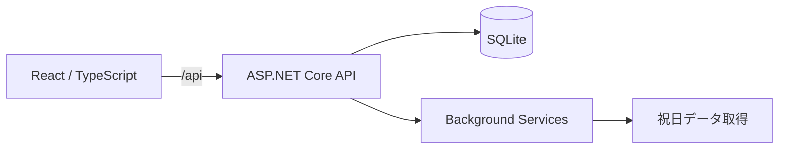

# COMPASS

<div align="center">
  
  <p><strong>チームの計画・実行・実績を、ひとつの時間軸につなぐ。</strong></p>
  <p>SI企業の複数案件、要員計画、課題、日報、運用保守をまとめて扱うプロジェクト管理プラットフォームです。</p>

  <p>
    
    
    
    
  </p>

  <p>
    <a href="#compassについて">COMPASSについて</a> ・
    <a href="#主な機能">主な機能</a> ・
    <a href="#クイックスタート">クイックスタート</a> ・
    <a href="#ロードマップ">ロードマップ</a> ・
    <a href="#関連ドキュメント">ドキュメント</a>
  </p>
</div>


## COMPASSについて

COMPASSは、受託開発や運用保守を行うシステム会社向けのプロジェクト管理アプリです。

`Team > Project > Task` を基本構造とし、案件ポートフォリオからGantt、課題、工数、日報、要員計画、分析までを一貫して扱います。単に予定を並べるのではなく、計画変更や実績を蓄積し、次の見積もりとリスク判断へつなげることを目指しています。

| 管理上の課題                     | COMPASSでの解決                                                  |
| -------------------------------- | ---------------------------------------------------------------- |
| 複数案件の状態が見渡せない       | チーム別ポートフォリオで進捗、マイルストーン、要対応案件を一覧化 |
| Ganttの更新に時間がかかる        | ドラッグ、インライン編集、ショートカット、一括操作で高速に更新   |
| 誰に仕事を任せられるか分からない | 人・チーム軸の稼働とアサイン計画を年間スパンで可視化             |
| 計画と実績が別々に残る           | タスク、課題、日報、工数、変更履歴をプロジェクトに集約           |
| 過去案件が次の見積もりに生きない | 変更回数、遅延、工数差、完了傾向を分析データとして保持           |

## 主な機能

| 領域         | 機能                                                                               |
| ------------ | ---------------------------------------------------------------------------------- |
| プロジェクト | チーム別ポートフォリオ、ステータス、メンバー、マイルストーン、プロジェクト設定     |
| Gantt        | 日・週・月表示、任意階層、ドラッグ移動・リサイズ、依存関係、基準計画、稼働日計算   |
| タスク操作   | インライン編集、キーボードショートカット、複数選択、一括移動、一括担当変更、表表示 |
| 課題・運用   | Markdown、返信、添付ファイル、課題管理、作業時間・運用保守時間の記録               |
| 要員計画     | 人軸・チーム軸の負荷、過負荷・不足・未アサイン、年間の稼働・アサイン計画           |
| レポート     | 個人・チームの日報、週次進捗、バーンダウン、個人・プロジェクト・チーム分析         |
| カレンダー   | 稼働日、非稼働日、日本の祝日、休日を考慮した期間と工数                             |
| 移行・管理   | Brabio XLSX取込、メンバー・ログイン統合管理、権限、チーム・カレンダーマスター      |

<table>
  <tr>
    <td width="50%">
      
    </td>
    <td width="50%">
      
    </td>
  </tr>
  <tr>
    <td align="center"><strong>プロジェクトGantt</strong></td>
    <td align="center"><strong>要員・稼働計画</strong></td>
  </tr>
</table>

## アーキテクチャ



- 初期表示では軽量なワークスペースサマリーだけを取得します。
- タスク明細は選択したプロジェクト単位で遅延取得します。
- 保存単位はプロジェクトで、バージョンによる楽観的同時実行制御を行います。
- Ganttは行仮想化し、大量タスクでも表示範囲だけをDOMへ配置します。
- SQLiteはWAL、外部キー制約、`synchronous = NORMAL`を有効化します。
- APIレスポンスは対応クライアントにZstandard圧縮を提供します。

詳しい取得境界と性能方針は [`docs/architecture.md`](docs/architecture.md) を参照してください。

## 技術スタック

| 領域           | 技術                                  |
| -------------- | ------------------------------------- |
| フロントエンド | React 19 / TypeScript 7 / Vite 8      |
| スタイリング   | Vanilla Extract / CSS                 |
| API            | ASP.NET Core 10 Minimal API           |
| 永続化         | SQLite / Entity Framework Core 10     |
| 圧縮           | gzip / Brotli / Zstandard             |
| E2E・性能検証  | Playwright                            |
| 静的検査       | TypeScript / Oxlint / .NET Analyzer   |
| 配布           | Docker / ASP.NET Core静的ファイル配信 |

## プロジェクト構成

```text
.
├── frontend/
│   ├── src/app/                  # アプリケーション状態と画面導線
│   ├── src/features/             # Gantt、案件、分析、日報などの機能
│   ├── src/components/           # 機能横断で利用するUIとレイアウト
│   ├── src/hooks/                # 共通Hooks
│   ├── src/data/                 # API、永続化、取込・出力
│   └── src/lib/                  # 日付、階層、負荷計算などのドメイン処理
├── backend/
│   └── src/Schedule.Api/         # API、ドメイン、EF Core、Migration
├── tests/
│   ├── e2e/                      # 認証、案件導線、保存、API契約
│   └── performance/              # 大量案件・大量タスクの性能検証
├── docs/                         # アーキテクチャとDB設計
└── Dockerfile                    # フロントエンドとAPIの統合イメージ
```

## クイックスタート

### 必要環境

- Node.js 20.19以上、または22.12以上
- npm / pnpm
- .NET SDK 10.0.301（`global.json`で固定）

### セットアップ

```bash
git clone https://github.com/msp0310/mirai.git
cd mirai

corepack enable
pnpm install
npm --prefix frontend ci
```

Playwrightを初めて使う環境では、Chromiumも導入します。

```bash
npx playwright install chromium
```

### 起動

APIとフロントエンドを別々のターミナルで起動します。

```bash
# Terminal 1: API
dotnet run \
  --project backend/src/Schedule.Api/Schedule.Api.csproj \
  --urls http://127.0.0.1:5080
```

```bash
# Terminal 2: Frontend
cd frontend
npm run dev -- --port 5174
```

[http://127.0.0.1:5174/](http://127.0.0.1:5174/) を開きます。Viteの`/api`プロキシは`http://127.0.0.1:5080`へ接続します。

社内システムや将来のMCPサーバーから連携する場合は、[外部データ連携REST API](docs/external-rest-api.md)を参照してください。

```bash
# API health check
curl http://127.0.0.1:5080/api/health
```

<details>
<summary>ローカル開発用アカウント</summary>

Development環境では、API起動時に次の管理者アカウントがSeedされます。

| 項目           | 値               |
| -------------- | ---------------- |
| メールアドレス | `pm@example.com` |
| パスワード     | `Password123!`   |
| 権限           | 管理者           |

このアカウントはローカル開発専用です。本番環境では作成されず、ログイン画面にも表示されません。

</details>

## Docker

```bash
docker build -t mirai:local .
docker run --rm \
  --name mirai \
  -e ASPNETCORE_ENVIRONMENT=Development \
  -p 8080:8080 \
  -v mirai-data:/data \
  mirai:local
```

[http://127.0.0.1:8080/](http://127.0.0.1:8080/) を開きます。SQLiteのデータは`mirai-data`ボリュームに保存されます。

本番運用では`ASPNETCORE_ENVIRONMENT=Production`を指定し、初期管理者の作成経路と秘密情報を別途用意してください。

## 検証

| 目的                     | コマンド                                   |
| ------------------------ | ------------------------------------------ |
| フロントエンド型検査     | `npm run check`                            |
| フロントエンド本番ビルド | `npm run build`                            |
| 静的検査                 | `npm run lint`                             |
| 全テスト                 | `npm run test:all`                         |
| Unit                     | `npm run test:unit`                        |
| API統合                  | `npm run test:integration`                 |
| E2E                      | `npm run test:e2e`                         |
| E2E UIモード             | `npm run test:e2e:ui`                      |
| 性能テスト               | `npm run test:performance`                 |
| テストコード型検査       | `npm run test:types`                       |
| APIビルド                | `dotnet build backend/ScheduleManager.sln` |

性能テストでは、大量案件、深いタスク階層、数千タスクの要員集計を継続的に確認します。

## ロードマップ

COMPASSの外部連携は、次の責務分担を前提に進めます。

| システム             | 正本となる情報                         | COMPASSでの役割                              |
| -------------------- | -------------------------------------- | -------------------------------------------- |
| COMPASS              | スケジュール、タスク、課題、工数、進捗 | 計画・実行・実績を管理                       |
| 社内IdP              | ユーザー識別子、認証、MFA              | SAML 2.0 SSOとCOMPASSメンバーを接続          |
| GitHub               | リポジトリ、PR、コミット               | COMPASS課題を開発者向けIssueとして展開       |
| 社内プロジェクト管理 | プロジェクト番号、顧客、契約・組織情報 | 案件マスターとCOMPASSプロジェクトを接続      |
| Microsoft Teams      | 会話と通知                             | 遅延、マイルストーン、週次報告をチームへ配信 |

### 0. 共通連携基盤

- Outboxによる非同期送信
- 冪等性、リトライ、手動再実行、デッドレター
- 同期状態と監査履歴の可視化
- 接続情報・秘密情報の安全な管理
- 外部システムごとのAdapter境界

### 1. SAML認証連携

- SAML 2.0のSP initiated SSOに対応
- Microsoft Entra ID、Oktaなど標準SAML IdPとの接続
- IdPメタデータXMLの取込と署名証明書の更新・ローテーション
- NameIDまたはメールアドレスによる既存COMPASSメンバーとの紐付け
- 未登録ユーザーのJust-In-Time作成は組織設定で明示的に許可
- IdP側で無効化されたユーザーのログイン拒否とセッション失効
- SSO障害時に限定利用する緊急用ローカル管理者アカウント
- ログイン、紐付け変更、認証失敗を監査ログへ記録

初期導入では既存メンバーとのメールアドレス一致を必須とし、自動ユーザー作成は無効を既定値にします。SAML Single LogoutはIdPごとの差異が大きいため、まずCOMPASS側セッションの確実な破棄を優先します。

### 2. GitHub連携

- 組織専用GitHub Appとプロジェクト・リポジトリの関連付け
- COMPASS課題の追加・更新によるGitHub Issue自動作成・更新
- COMPASS課題の完了・再開によるIssueのClose・Reopen
- ラベル、担当者、COMPASSへのリンクを同期
- GitHub側の状態を定期取得し、差異を表示
- PR、コミット、リリースとの関連付け

COMPASSを課題の正本とし、GitHub側で終了したIssueはまず「外部で終了済み」として検知します。COMPASSへの自動反映はプロジェクト設定で選択できる形を想定します。

### 3. 社内プロジェクト管理連携

- `ProjectNo`と不変な外部IDによるプロジェクト関連付け
- 社内案件を検索してCOMPASSプロジェクトを作成
- 顧客、担当組織、PM、期間、ステータスの参照同期
- 重複・不一致・同期失敗の検出
- 進捗、工数、マイルストーン、課題実績の書き戻し
- 計画と実績を使った見積もり精度・リスク分析

初期段階は参照同期から始め、社内システムへの書き戻しは項目単位で明示的に許可します。

### 4. Microsoft Teams連携

- COMPASSプロジェクトとTeamsチャンネルの関連付け
- 遅延発生、期限接近、重大課題、マイルストーン影響の通知
- 週次進捗サマリーと日報・工数未入力の通知
- GitHub・社内システム連携エラーの管理者通知
- Adaptive CardからCOMPASSの対象画面を直接開く導線
- 通知頻度、対象、静穏時間、メンションのプロジェクト別設定

通常通知はTeamsへ集約し、重大な遅延や未確認状態が続く場合だけメールへエスカレーションします。

| 状況                 | 通知先                        |
| -------------------- | ----------------------------- |
| 初回の遅延検知       | プロジェクトのTeamsチャンネル |
| 2営業日以上の遅延    | Teamsで担当者・PMへ通知       |
| マイルストーンへ影響 | Teamsへ即時通知               |
| 重大な遅延が未確認   | PM・管理者へメールでも通知    |
| 通常の遅延一覧       | Teamsへ日次サマリー           |

### 5. 横断分析

- 見積工数と実績工数の差
- フェーズ別の超過率とスケジュール変更回数
- GitHub Issueの滞留期間と完了速度
- 類似プロジェクト比較と次回見積もりの補正
- 個人・チーム・プロジェクト単位の負荷とリスク傾向

連携先がさらに増え、業務部門がフローを頻繁に変更する段階では、n8nなどの連携基盤を通知・周辺自動化へ導入します。プロジェクト状態を決める中核ルールは引き続きCOMPASSに保持します。

## 設計原則

- `Team > Project > Task`を主要な情報構造とします。
- `未所属`は仮想チームではなく、`team_id = NULL`の表示ラベルとして扱います。
- 全案件の詳細を一括取得せず、一覧サマリーとプロジェクト詳細を分離します。
- タスク、担当者、依存関係はID単位で差分保存します。
- Brabio取込は汎用CSVではなく、Brabio XLSX専用の移行フローとして扱います。
- スケジュール変更履歴を、将来の見積もり改善・リスク分析につなげます。
- 外部連携はユーザー操作を待たせず、失敗を隠さず、再実行可能にします。

## 開発ルール

コミットメッセージは[Conventional Commits](https://www.conventionalcommits.org/ja/v1.0.0/)に従います。

```text
feat(gantt): タスクの一括移動を追加
fix(auth): ログイン失敗時のエラー表示を修正
docs: READMEに連携ロードマップを追加
```

利用できるtype、scope、破壊的変更の扱いは [`CONTRIBUTING.md`](CONTRIBUTING.md) にまとめています。

## 関連ドキュメント

- [`docs/architecture.md`](docs/architecture.md): API境界、保存、性能方針
- [`docs/databases/README.md`](docs/databases/README.md): データモデルとDB設計
- [`docs/api-frontend-notes.md`](docs/api-frontend-notes.md): APIとフロントエンドの接続メモ
- [`frontend/design-qa.md`](frontend/design-qa.md): フロントエンドの検証記録
- [`frontend/product-backlog.md`](frontend/product-backlog.md): 今後の改善候補
- [`docs/releases/README.md`](docs/releases/README.md): リリースノートの生成・公開手順
- [`CONTRIBUTING.md`](CONTRIBUTING.md): 開発・コミット規約
